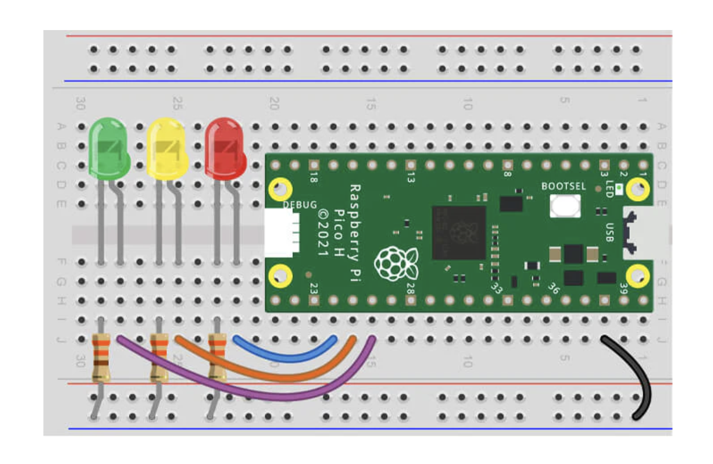

# Project with LEDs

## Getting started

You'll need the following to construct the circuit:

- 1x 5mm Red LED (with a clear lens)
- 1x 5mm Amber LED (with a clear lens)
- 1x 5mm Green LED (with a clear lens)
- 3x 330 ohm resistors
- 4x Male to male jumper wires

The scripts have been written using the following wiring map:

