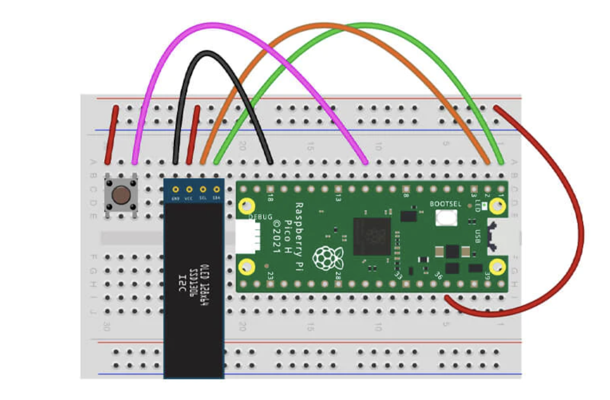
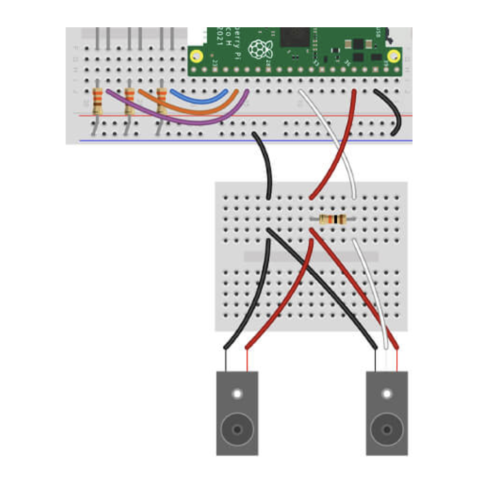

# Project with OLED I2C

## Getting started

You'll need the following to construct the circuit:

- 1x Pre-soldered 0.96" OLED I2C display (128x32)
- 4x Male to male jumper wires

You'll also need to install the micropython-ssd1306 package to your Pico. To do this go to Tools > Manage packages in the Thonny IDE and search for micropython-ssd1306.

The scripts have been written using the following wiring map:

