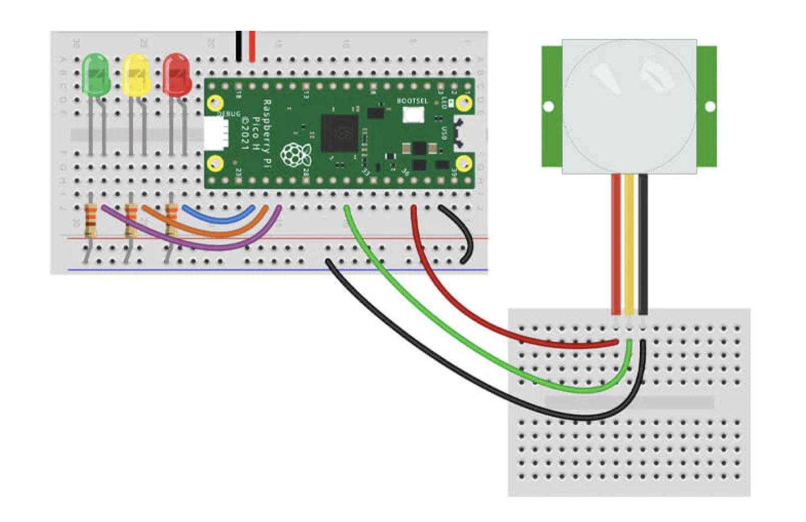

# Project with PIR sensor

## Getting started

You'll need the following to construct the circuit:

- 1x Mini PIR Sensor
- 3x Male to male jumper wires

The scripts have been written using the following wiring map. GND Pin is on the right and 3.3V Pin on the left on the above:

