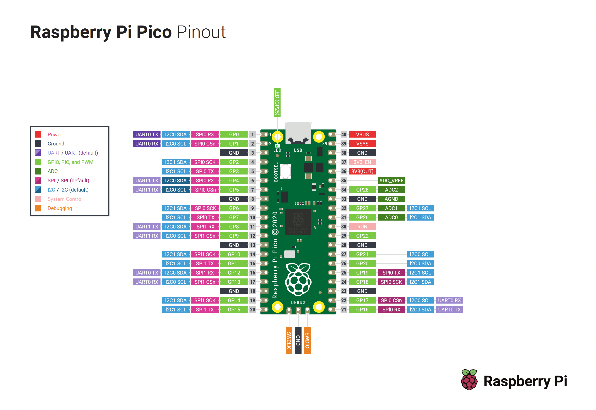

# Raspberry Pi Pico Projects

## Description

This is a collection of small projects using the Raspberry Pi Pico microcontroller board and MicroPython.

## Getting started

This is the wiring map for the Pico for reference:

(These steps assume that headers have already been soldered to the Pico. The projects are then using solderless breadboards to construct circuits with the Pico.)

- To get started with the Pico, install Thonny to your computer from https://thonny.org.
- Install MicroPython to the Pico:

  - press the BOOTSEL button on the Pico whilst connecting the Pico to the computer with a USB cable.
  - in Thonny at the bottom-right-hand corner the Raspberry Pi Pico should appear with a COM port. Click on this and select 'Install MicroPython...'

- Set up Thonny to use the MicroPython Pico interpreter:
  - From the top menu select 'Run' and 'Configure interpreter'. Select 'MicroPython (Raspberry Pi Pico)' in the dialog box.
