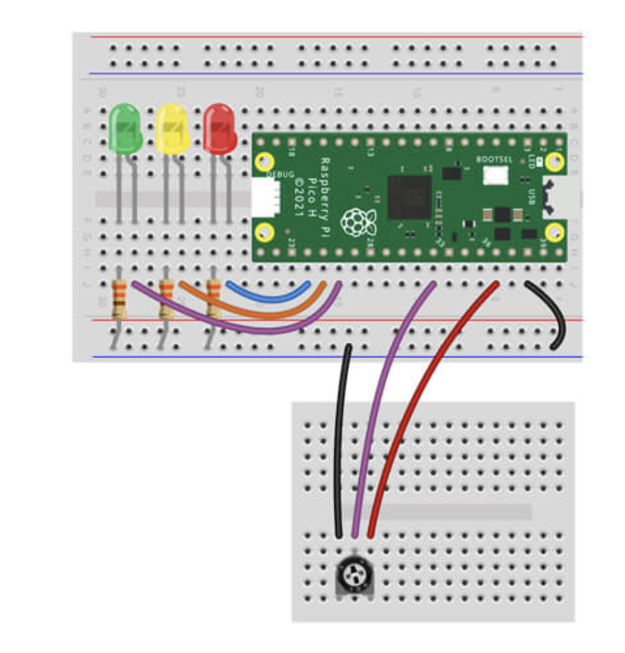

# Project with potentiometer

## Getting started

You'll need the following to construct the circuit:

- 1x 10k Potentiometer
- 1x Potentiometer knob
- 1x Washer (may be fitted to the potentiometer already)
- 1x Nut (may be fitted to the potentiometer already)
- 3x Male to male jumper wires

The scripts have been written using the following wiring map:

