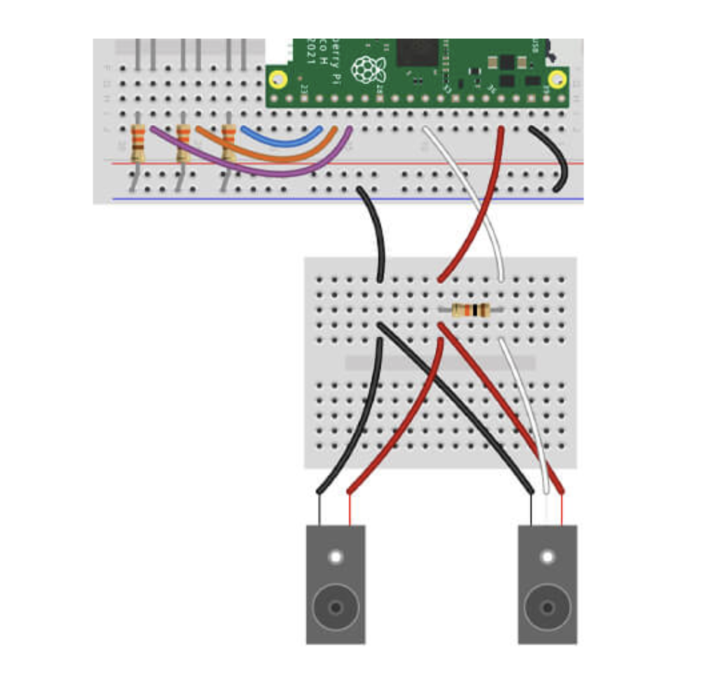

# Project with break beam sensor

## Getting started

You'll need the following to construct the circuit:

- 1x Break Beam Sensor (emitter and receiver) with male jumper wire ends
- 1x 10k resistor
- 4x Male to male jumper wires

The scripts have been written using the following wiring map:

