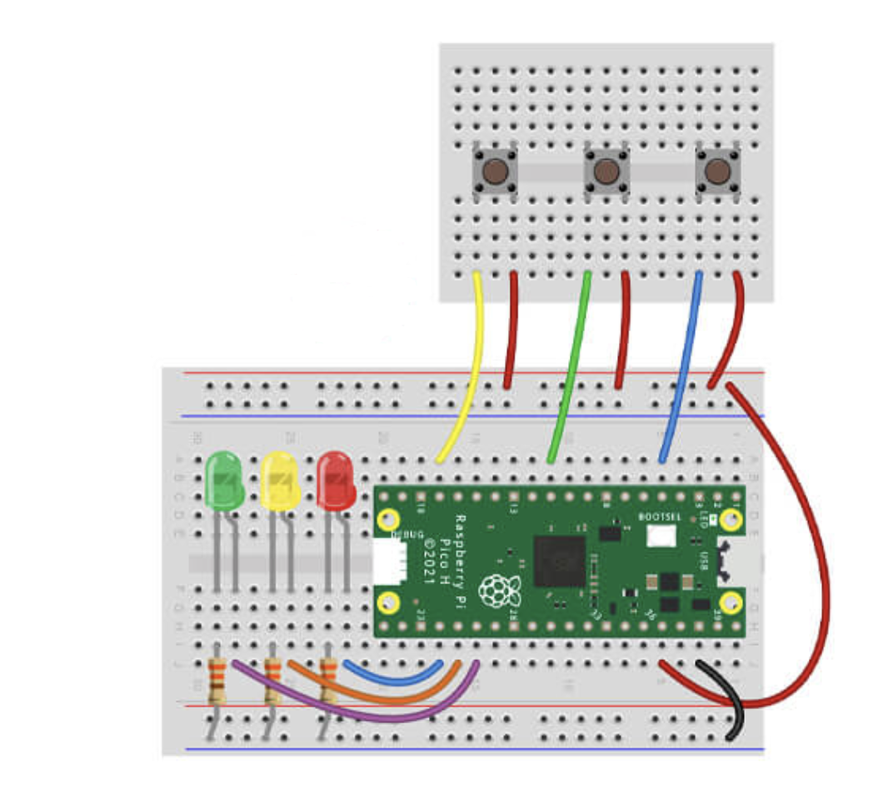

# Project with buttons

## Getting started

You'll need the following to construct the circuit:

- 1x Mini Breadboard
- 3x Tall Tactile Buttons
- 3x Button caps
- 7x Male to male jumper wires

The scripts have been written using the following wiring map:

