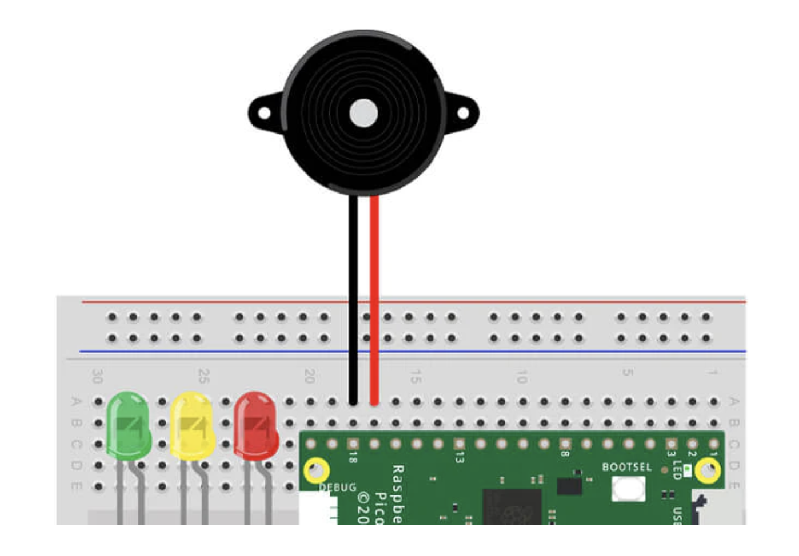

# Project with buzzer

## Getting started

You'll need the following to construct the circuit:

- 1x pre-wired buzzer with male jumper wire ends

The scripts have been written using the following wiring map:

