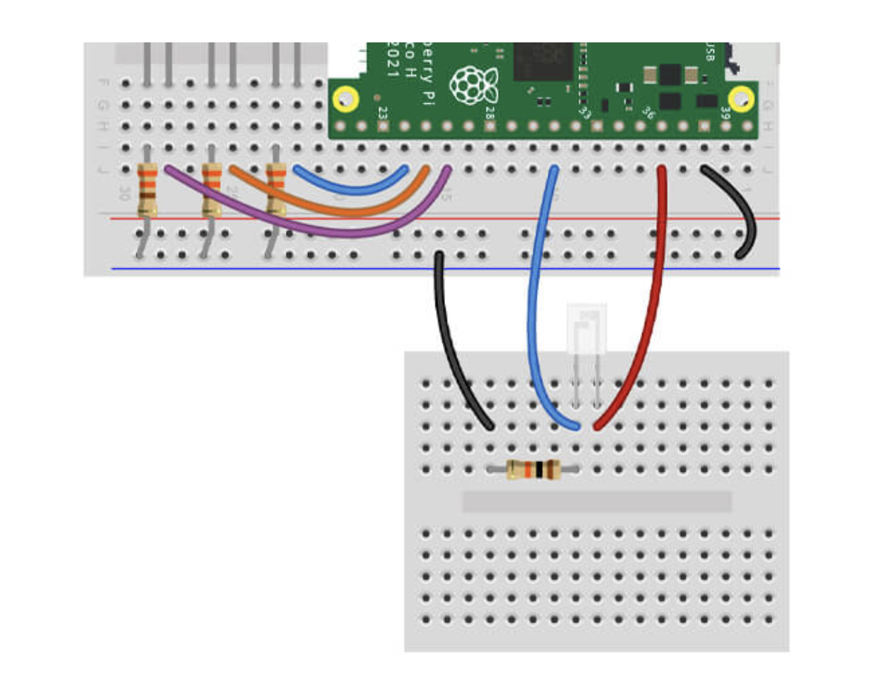

# Project with photo transistor

## Getting started

You'll need the following to construct the circuit:

- 1x Photo Transistor
- 1x 10k Resistor
- 3x Male to male jumper wires

The scripts have been written using the following wiring map:

