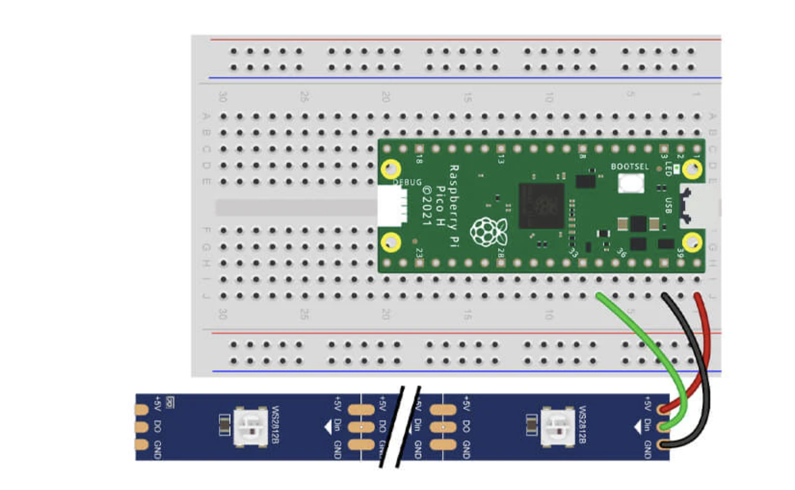

# Project with RGB LED strip

## Getting started

You'll need the following to construct the circuit:

- 1x WS2812 Addressable LED strip with male jumper wires

The scripts have been written using the following wiring map:

