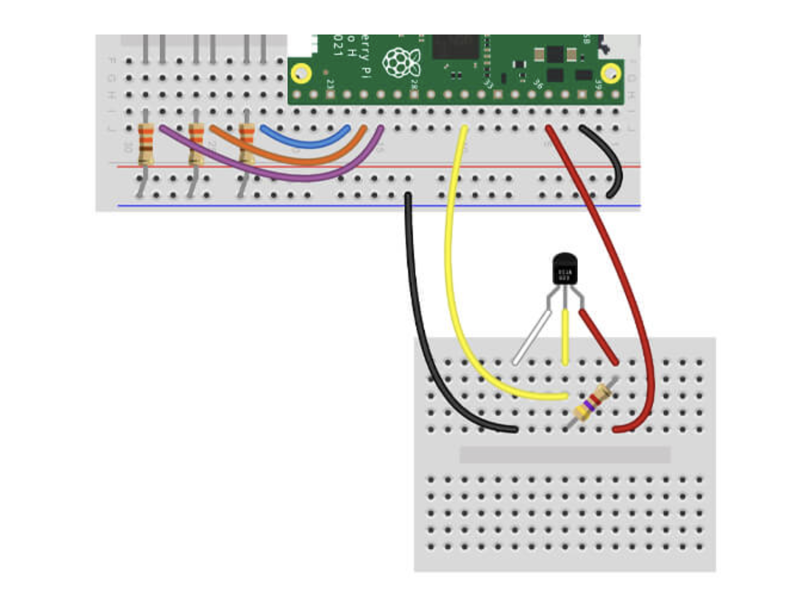

# Project with temperature sensor

## Getting started

You'll need the following to construct the circuit:

- 1x Waterproof 1-wire temperature sensor with male jumper wires
- 1x 4.7k resistor
- 3x Male to male jumper wires

The scripts have been written using the following wiring map. GND Pin on the left and 3.3V Pin on the right on the below:

