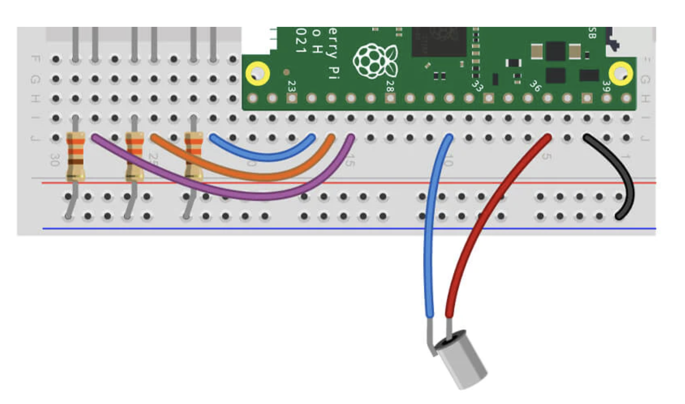

# Project with tilt sensor

## Getting started

You'll need the following to construct the circuit:

- 1x Tilt sensor/switch
- 2x Male to male jumper wires
- 2x Male to female jumper wires

The scripts have been written using the following wiring map:

